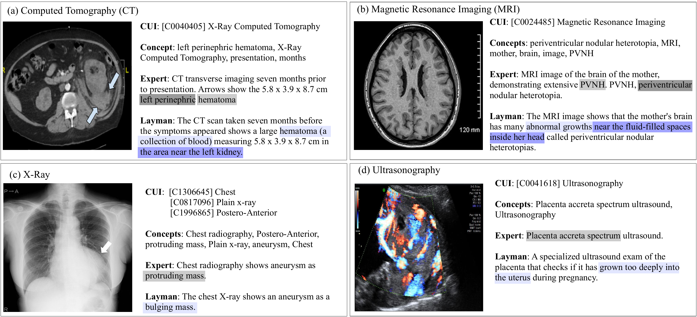

<div align="center">

# MedLayBench-V

**A Large-Scale Benchmark for Expert&ndash;Lay Semantic Alignment in Medical Vision-Language Models**

Han Jang<sup>\*</sup>, Junhyeok Lee<sup>\*</sup>, Heeseong Eum, Kyu Sung Choi<sup>&dagger;</sup>

<sub>Seoul National University &middot; SNU College of Medicine &middot; SNU Hospital &middot; AICON Lab</sub>

<sub><sup>\*</sup> Equal contribution. &nbsp; <sup>&dagger;</sup> Corresponding author.</sub>

[Project Page](https://janghana.github.io/MedLayBench-V/) &middot;
[Hugging Face Dataset](https://huggingface.co/datasets/hanjang/MedLayBench-V) &middot;
Paper (ACL 2026 Findings, Oral)

</div>

---

> **TL;DR.** The first 80K-scale medical image benchmark with **expert and verified lay
> captions**, built by concept-grounded refinement.

## Dataset


`image` — the medical image (CT / MRI / X-Ray / Ultrasound / ...)
`cuis` — list of UMLS CUIs from MedCAT (e.g. `["C0040405"]`)
`expert_caption` — expert caption $T_{\text{exp}}$
`layman_caption` — SCGR-refined lay caption $T_{\text{lay}}$
layman_caption str    SCGR-refined lay caption $T_{\text{lay}}$
```

| Split      | #Samples |
|------------|---------:|
| Train      | 59,962   |
| Validation | 9,904    |
| Test       | 9,927    |
| **Total**  | **79,793** |

```python
from datasets import load_dataset
ds = load_dataset("hanjang/MedLayBench-V")
```

See [`tutorials/dataset.ipynb`](tutorials/dataset.ipynb) for an end-to-end walkthrough.

## SCGR &mdash; Structured Concept-Grounded Refinement

SCGR builds the lay caption by anchoring it to two complementary constraint sources:

- **C<sub>onto</sub>** &mdash; ontology constraints from
  [UMLS Metathesaurus](https://www.nlm.nih.gov/research/umls/) CUIs, predicted by
  [MedCAT](https://github.com/CogStack/MedCAT2), and grounded to patient-friendly
  definitions via [MedlinePlus](https://medlineplus.gov/).
- **C<sub>ent</sub>** &mdash; fine-grained entity constraints (sizes, anatomy,
  laterality) extracted by [SciSpacy](https://allenai.github.io/scispacy/) NER.

The constraint set `$C = C_{\text{onto}} \cup C_{\text{ent}}$` is then passed to
[Llama-3.1-8B-Instruct](https://huggingface.co/meta-llama/Meta-Llama-3.1-8B-Instruct)
which is restricted to grammar / fluency rewriting, never to inventing facts.

```python
from model.SCGR import SCGRPipeline

scgr = SCGRPipeline(umls_api_key="YOUR_UMLS_KEY")
expert = "Thoracic CT scan showing perihilar lymphadenomegaly."
print(scgr.refine(expert, cuis=["C0040405", "C0024265"]))
# The Chest CT scan shows enlarged lymph nodes near the center of the lungs.
```

Implementation lives in [`model/SCGR/`](model/SCGR/).

## Qualitative Examples



## Repository Layout

```
.
├── README.md
├── assets/                    figures
├── data/                      sample previews
├── model/SCGR/                Structured Concept-Grounded Refinement
└── tutorials/dataset.ipynb    load, browse, and analyze MedLayBench-V
```

## Installation

```bash
git clone https://github.com/janghana/MedLayBench-V.git
cd MedLayBench-V
pip install -r requirements.txt
```

## Citation

```bibtex
@misc{jang2026medlaybenchvlargescalebenchmarkexpertlay,
      title={MedLayBench-V: A Large-Scale Benchmark for Expert-Lay Semantic Alignment in Medical Vision Language Models}, 
      author={Han Jang and Junhyeok Lee and Heeseong Eum and Kyu Sung Choi},
      year={2026},
      eprint={2604.05738},
      archivePrefix={arXiv},
      primaryClass={cs.CL},
      url={https://arxiv.org/abs/2604.05738}, 
}
```

## License

The dataset inherits the license of [ROCOv2](https://huggingface.co/datasets/eltorio/ROCOv2-radiology)
(CC BY-NC-SA 4.0). Code is released under the MIT License.
